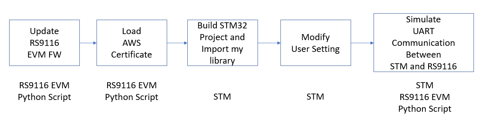

# Tutorial : RS9116 Connect to AWS using MQTT \(UART Library implement by STM\)

#### This is the flow chart implement  RS9116 Using RS9116 EVM and STM32 Nucleo board

##  1.RS9116 EVM Firmware update

Need  update  EVM FW  , it can reference silicon lab opensource document.

 [AN1290: RS9116W Firmware Update Application Note](https://www.silabs.com/documents/login/application-notes/an1290-rs9116w-firmware-update-application-note.pdf)

## 2.Load AWS Certificate using python script

Silicon provide simple Python 2.7 script to upload AWS certificate to RS9116 module. but little complex.

so my work mate rewrite it ,you also can find python script in my project

## _3.Need modify here after library complete_

\_\_

## 4.Application Test

Unfortunately, In RS9116 EVM Board don't have TX/RX pinout\(can't bypass form USB virtual comport driver like cp2302 \), I try connect GPIO\_8 \(RSI9116 TX\),GPIO\_9 \(RSI9116 RX\) by jumper . and USB port just plug in Power port . But still have some bug and unstable\(If have better solutionplease tell me\)

In the end I wrote a python script, just simple exchange data between two virtual comport ,and monitor by CMD\( you also can find this script form my git project\),Block diagram is below

So using this python script, In Hardware setting   just connect STM and RSI 9116 EVM  in USB port .After Execute python script , chose you comport ,then you can start your project

  

